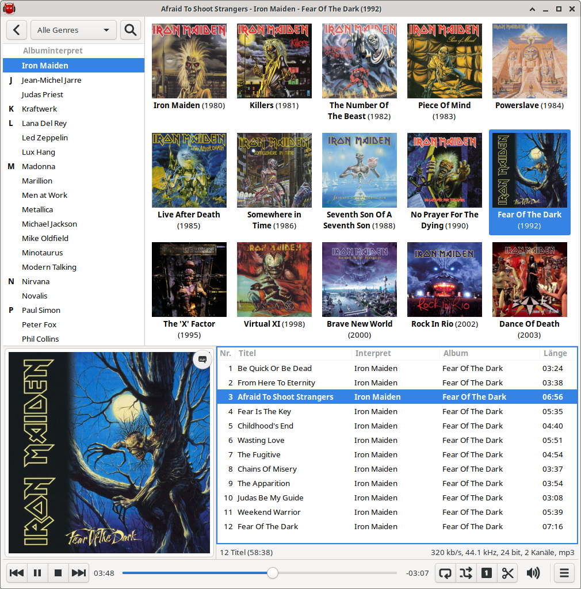

README for mpdevil
==================
mpdevil is focused on playing your local music directly instead of managing playlists or playing network streams. So it neither supports saving playlists nor restoring them. Therefore mpdevil is mainly a music browser which aims to be easy to use. mpdevil dosen't store any client side database of your music library. Instead all tags and covers get presented to you in real time. So you'll never see any outdated information in your browser. mpdevil strongly relies on tags.

Features
--------

- play songs without doubleclicking
- search songs in your music library
- manage multiple mpd servers
- filter by genre
- control with media keys
- displays covers
- sends notifications on title change
- fetches lyrics from the web (based on PyLyrics)
- MPRIS interface (based on mpDris2)

See: https://github.com/SoongNoonien/mpdevil/wiki/Usage
    
Package Installation
--------------------

See:
https://github.com/SoongNoonien/mpdevil/releases/latest
    
Ubuntu, Debian, Mint:
- Download the .deb file
- Open a console
- Navigate into download dir
- Run: `sudo apt install ./mpdevil_VERSION-1_amd64.deb`

Arch, Manjaro:
- Download the PKGBUILD
- Open a console
- Navigate into download dir
- Run: `makepkg -sirc`

Gentoo (see: https://wiki.gentoo.org/wiki/Custom_repository):
- Download the .ebuild
- Place it into your local tree
- Generate manifest file
- Run: `emerge mpdevil`

Building
--------

Dependencies:
- Gtk3
- Python3

Python modules:
- mpd (python-mpd2)
- gi (Gtk, Gio, Gdk, GdkPixbuf, Pango, GObject, GLib, Notify)
- requests
- bs4 (beautifulsoup)
- dbus

To build and install from source, use:

    ./autogen.sh
    make
    make install
    
