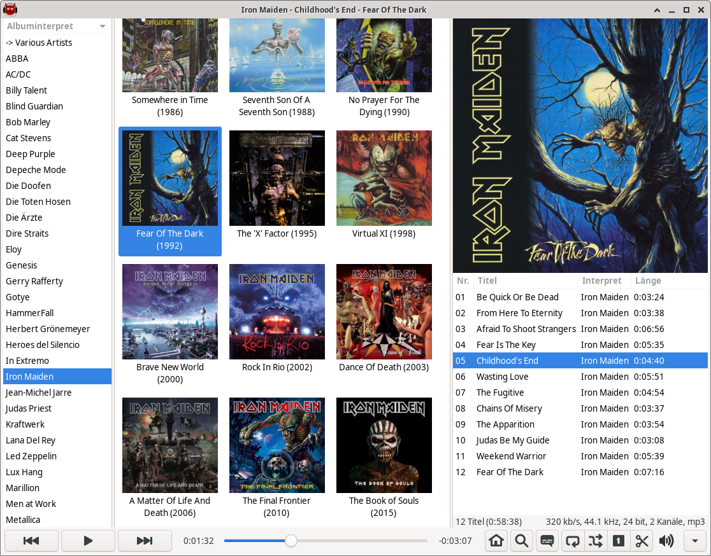

README for mpdevil
==================
mpdevil is focused on playing your local music directly instead of managing playlists or playing network streams. So it neither supports saving playlists nor restoring them. Therefore mpdevil is mainly a music browser which aims to be easy to use. mpdevil dosen't store any client side database of your music library. Instead all tags and covers get presented to you in real time. So you'll never see any outdated information in your browser. mpdevil strongly relies on tags.

Features
--------

1. playing songs without doubleclicking
2. displaying covers
3. fetching lyrics form the web (based on PyLyrics 1.1.0)
4. searching songs in your music library
5. removing single tracks form playlist by hovering and pressing del
6. appending albums by middleclick
7. query albums by rightclick 
8. sending notifications on title change
9. managing multiple mpd servers
10. filtering by genre

TODO
----
1. Support media keys
2. MPRIS interface

Building and installation
-------------------------

To build from source, use:

    ./autogen.sh
    make
    make install
    
