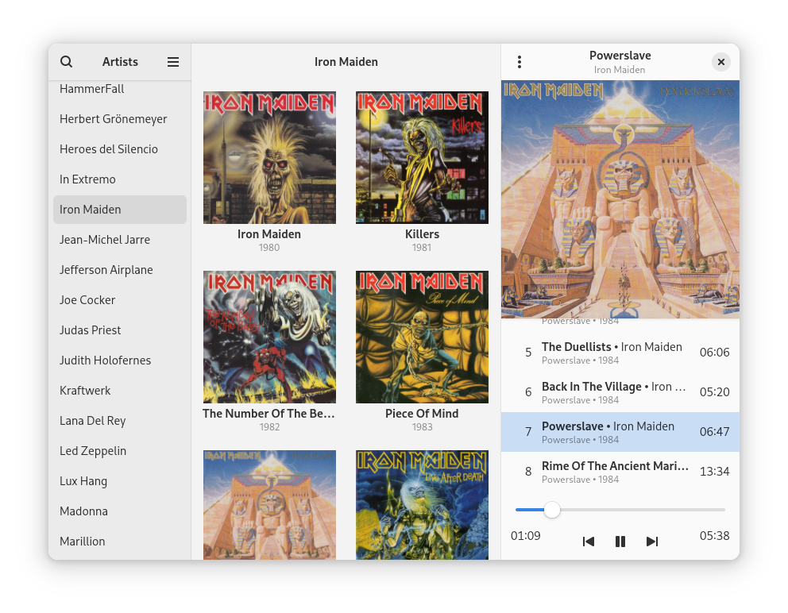

# Plattenalbum

[](https://flathub.org/apps/de.wagnermartin.Plattenalbum)



A client for the Music Player Daemon (MPD).

Browse your collection while viewing large album covers. Play your music without managing playlists.</p>

## Installation

### Flatpak

<a href='https://flathub.org/apps/details/de.wagnermartin.Plattenalbum'></a>

### Distribution Packages

[](https://repology.org/project/plattenalbum/versions)

## Building

Install the following dependencies on your system.

### Build Dependencies
- meson
- gettext
- glib2 (Ubuntu/Debian: libglib2.0-dev-bin, libglib2.0-bin)

### Runtime Dependencies
- GTK4 >=4.20.0
- libadwaita >=1.8.0
- Python3

#### Python Modules
- mpd (python-mpd2 >=3.1.0)
- gi (Gtk, Adw, Gio, Gdk, Pango, GObject, GLib)

Execute the following commands to build and install the program.
```bash
git clone https://github.com/SoongNoonien/plattenalbum.git
cd plattenalbum
meson setup builddir --prefix=/usr/local
sudo ninja -C builddir install
```

## Contributing

Please try to follow the [GNOME Code of Conduct](https://conduct.gnome.org).

### Translation

This program is currently available in various languages which can be found in `po/`. If you speak one of these or even another language, you can easily translate it by using [poedit](https://poedit.net). Just import `po/de.wagnermartin.Plattenalbum.pot` from this repo into `poedit`. To test your translation, copy the new `.po` file into the `po` directory of your cloned plattenalbum repo and proceed as described in the [Building](#building) section. To get your translation merged, just send me an e-mail or create a pull request.
