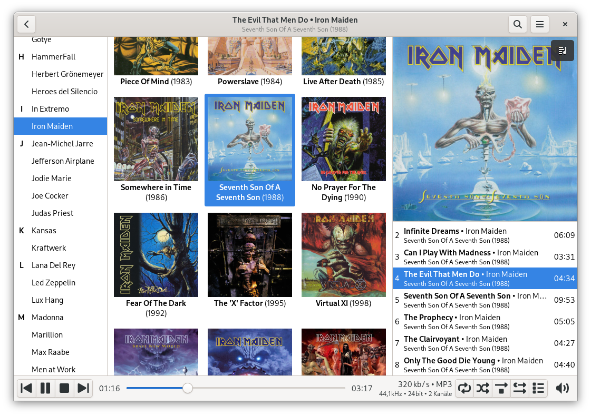

README for mpdevil
==================
mpdevil is a simple music browser for the Music Player Daemon (MPD) which is focused on playing local music without the need of managing playlists. Instead of maintaining a client side database of your music library, mpdevil loads all tags and covers on demand. So you'll never see any outdated information in the browser. mpdevil strongly relies on tags.



Features
--------

- display large covers
- play songs without double click
- lyrics from: https://www.letras.mus.br
- MPRIS interface (based on mpDris2)
- manage multiple MPD servers
- basic queue manipulation (move and delete single tracks)

See: https://github.com/SoongNoonien/mpdevil/wiki/Usage

Package Installation
--------------------

See:
https://github.com/SoongNoonien/mpdevil/releases/latest

Ubuntu, Debian, Mint, Raspberry Pi OS:
- Download the .deb file
- Open a console
- Navigate into download dir
- Run: `sudo apt install ./mpdevil_VERSION.deb`

Arch, Manjaro (see: https://aur.archlinux.org/packages/mpdevil/):
- Download the PKGBUILD from the AUR
- Open a console
- Navigate into download dir
- Run: `makepkg -sirc`
- Alternatively install it with an AUR helper

Gentoo (see: https://wiki.gentoo.org/wiki/Custom_repository):
- Download the .ebuild
- Place it into your local tree
- Generate manifest file
- Run: `emerge mpdevil`

Flatpak:

<a href='https://flathub.org/apps/details/org.mpdevil.mpdevil'></a>

Building
--------

Build dependencies:
- meson

Dependencies:
- GTK3
- Python3

Python modules:
- mpd (python-mpd2 >=1.1)
- gi (Gtk, Gio, Gdk, GdkPixbuf, Pango, GObject, GLib)
- cairo (pycairo)

Run:
```bash
git clone https://github.com/SoongNoonien/mpdevil.git
cd mpdevil
meson builddir --prefix=/usr/local
sudo ninja -C builddir install
sudo glib-compile-schemas /usr/local/share/glib-2.0/schemas
sudo gtk-update-icon-cache
sudo update-desktop-database
```

Translation
-----------

This program is currently available in English, German, Dutch, Bulgarian, Turkish and Polish. If you speak one of these or even another language, you can easily translate it by using [poedit](https://poedit.net). Just import `po/mpdevil.pot` from this repo into `poedit`. To test your translation, copy the new `.po` file into the `po` directory of your cloned mpdevil repo and proceed as described in the [Building](#building) section. To get your translation merged, just send me an e-mail or create a pull request.
