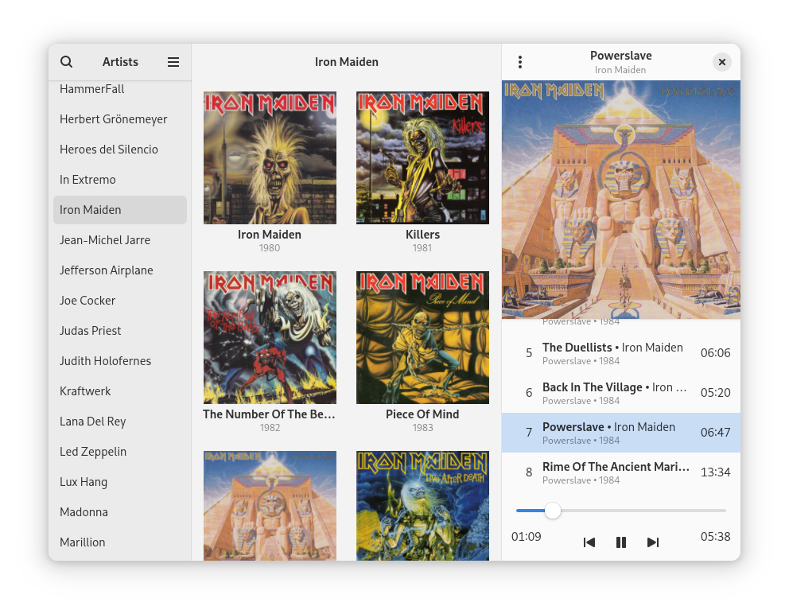

# Plattenalbum

[](https://flathub.org/apps/de.wagnermartin.Plattenalbum)



A client for the Music Player Daemon (MPD).

Browse your collection while viewing large album covers. Play your music without managing playlists.</p>

## Tags

Plattenalbum exclusively uses tags to structure your music. The artist names you see in the left pane are all distinct values of the `albumartist` tag in your collection. If a file does not have an `albumartist` tag, its `artist` tag is used instead. This fallback is done by MPD automatically. If all files sharing a common `albumartist` tag also share a common `albumartistsort` tag, its value is used for sorting in the left pane. If you wonder why, for example, "The Beatles" appear next to other artists starting with the letter "B" you might want to check your tags again. It this case, your files probably have an `albumartistsort` tag with a value like "Beatles, The". Without an `albumartist` tag, no special treatment of artist names is done for sorting.

An album in the middle pane represents all files in your collection sharing a common `albumartist`, `album` and `date` tag. The `albumsort` tags are ignored and the albums are sorted according to their `date` tag. The usual `artist` tag is considered as a property of individual songs. So, tagging compilation albums is quite easy. Just choose an `albumartist` like "Various" for the respective album and it will show up under "Various" while the individual songs still have the correct artist attached to them.

It is also possible to store multiple values in the same tag. For example the `artist` tag of a song could contain two artists involved in the creation. They get displayed as a comma separated list in the player. Similarly, if all songs of an album contain the values "A" and "B" for the `albumartist` tag, this album will appear in the album list of "A" and "B".

## Installation

### Flatpak

<a href='https://flathub.org/apps/details/de.wagnermartin.Plattenalbum'></a>

### Distribution Packages

[](https://repology.org/project/plattenalbum/versions)

## Building

Install the following dependencies on your system.

### Build Dependencies
- meson
- gettext
- glib2 (Ubuntu/Debian: libglib2.0-dev-bin, libglib2.0-bin)

### Runtime Dependencies
- GTK4 >=4.20.0
- libadwaita >=1.8.0
- Python3

#### Python Modules
- mpd (python-mpd2 >=3.1.0)
- gi (Gtk, Adw, Gio, Gdk, Pango, GObject, GLib)

Execute the following commands to build and install the program.
```bash
git clone https://github.com/SoongNoonien/plattenalbum.git
cd plattenalbum
meson setup builddir --prefix=/usr/local
sudo ninja -C builddir install
```

## Contributing

Please try to follow the [GNOME Code of Conduct](https://conduct.gnome.org).

### Translation

This program is currently available in various languages which can be found in `po/`. If you speak one of these or even another language, you can easily translate it by using [poedit](https://poedit.net). Just import `po/de.wagnermartin.Plattenalbum.pot` from this repo into `poedit`. To test your translation, copy the new `.po` file into the `po` directory of your cloned plattenalbum repo and proceed as described in the [Building](#building) section. To get your translation merged, just send me an e-mail or create a pull request.
