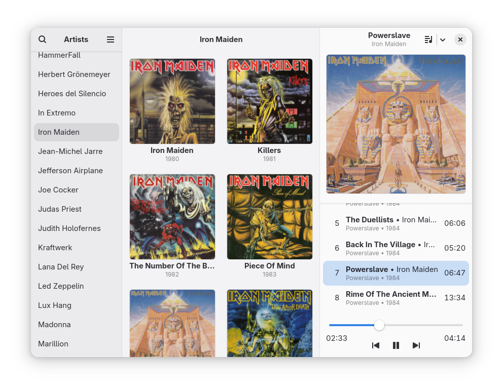

# Plattenalbum

A client for the Music Player Daemon (MPD).

Browse your collection while viewing large album covers. Play your music without managing playlists.</p>



## Installation

### Flatpak

<a href='https://flathub.org/apps/details/de.wagnermartin.Plattenalbum'></a>

### Arch

Plattenalbum can be obtained through the [AUR](https://aur.archlinux.org/packages/plattenalbum). Also the [latest development version](https://aur.archlinux.org/packages/plattenalbum-git) is available there.

### Gentoo

After you have set up a [custom repository](https://wiki.gentoo.org/wiki/Custom_repository) you can do the following.
- Download the [.ebuild](https://github.com/SoongNoonien/plattenalbum/releases/latest)
- Place it into your local tree
- Generate manifest file
- Run: `emerge plattenalbum`

## Building

Install the following dependencies on your system.

### Build Dependencies
- meson
- gettext
- glib2 (Ubuntu/Debian: libglib2.0-dev-bin, libglib2.0-bin)

### Runtime Dependencies
- GTK4 >=4.12.0
- libadwaita >=1.6.0
- Python3

#### Python Modules
- mpd (python-mpd2 >=3.1)
- gi (Gtk, Adw, Gio, Gdk, Pango, GObject, GLib)

Execute the following commands to build and install the program.
```bash
git clone https://github.com/SoongNoonien/plattenalbum.git
cd plattenalbum
meson setup builddir --prefix=/usr/local
sudo ninja -C builddir install
```

## Contributing

Please try to follow the [GNOME Code of Conduct](https://conduct.gnome.org).

### Translation

This program is currently available in English, German, Dutch, Bulgarian, Turkish, Polish, French, Japanese, Hindi, Russian and Brazilian Portuguese. If you speak one of these or even another language, you can easily translate it by using [poedit](https://poedit.net). Just import `po/de.wagnermartin.Plattenalbum.pot` from this repo into `poedit`. To test your translation, copy the new `.po` file into the `po` directory of your cloned plattenalbum repo and proceed as described in the [Building](#building) section. To get your translation merged, just send me an e-mail or create a pull request.
